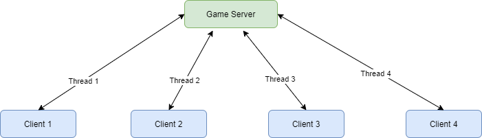

## Game Engine Development in C++

In this project, I built a game engine in C++ from scratch. It allows multiple players to play the game synchronously and works well for 2D platformers. It follows object-oriented design and makes extensive use of inheritance, encapsulation, abstraction, and polymorphism. Other key concepts that were used are from client-server communication, event handling, logical time, multithreading, physics, and socket programmning.

### Libraries Used
1. SFML (Simple and Fast Multimedia Library): For providing simple application programming interface to various multimedia components. [Download](https://www.sfml-dev.org/download.php)
2. ZeroMQ: For communicating between client and server through message passing. [Download](https://github.com/zeromq/cppzmq)
3. MessagePack: It is an efficient binary serialization format which lets one exchange data among multiple languages like JSON. [Download](https://github.com/msgpack/msgpack-c/tree/cpp_master)

### Demo

### Design and Implementation Details

#### Game loop architecture
I used 'One thread per Client' architecture. Whenever a new client is created, it sends a connection request to the server and then the server replies the client with a port number. The client breaks connects to the server on the port number specified by the server. Every client is continuously listening to the events and in case of an event the client sends the event details to the server. The events are queued on the server side and the server handles the events on first come first serve basis. The server performs the calculations and sends the updated game state to all the clients.

#### Time synchronization
The server maintains a logical clock and it starts when the server starts. Whenever a client connects to the server, the server sends this logical time to the client. The client adds this offset value to its local time so that the client clock is synchronized with the server clock. The elapsed time is calculated by the client using the formula elapsed time = ((current time - start time) / step_size) * speed + offset + 1, where step_size is the tic value of the clock.

#### Request/Reply model for communication
The communication model used by client and server is Request/Reply. Here, client connects to the server, requests info, then receives a reply.

### Instructions for running the project
1. Run the executable file for starting the server - Server\Debug\HW4_Server_Part2.exe
2. Run the executable file for starting the client - Client\Debug\HW4_Client_Part2.exe
3. Run mulitple instances of client for playing in multiplayer mode. Maximum of 4 players can play the game at the same time.

### Instructions for playing the game
Use arrow keys for moving the player character.
1. Press left arrow key to move left.
2. Press right arrow key to move right.
3. Press up arrow key to jump.
